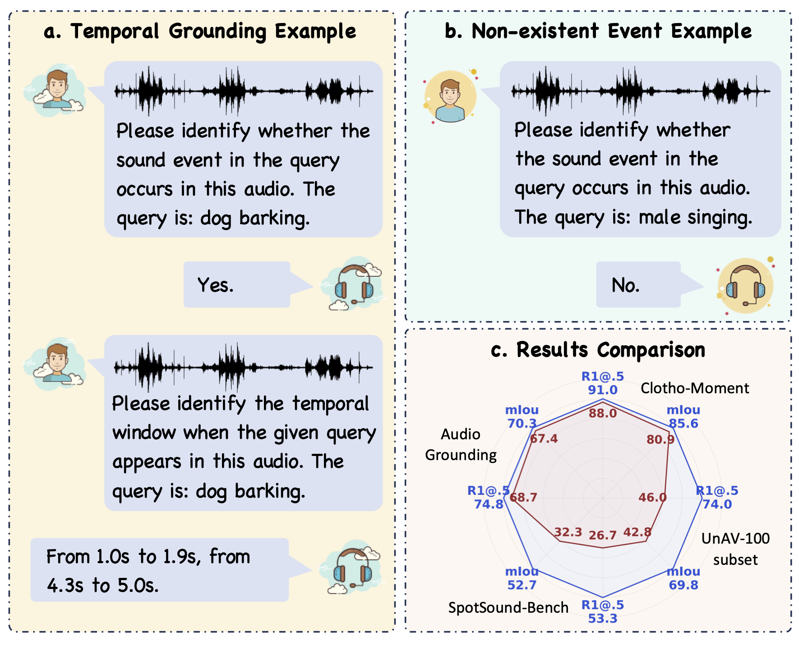

# SpotSound
This repository provides the official PyTorch implementation of **"SpotSound: Enhancing Large Audio-Language Models with Fine-Grained Temporal Grounding"**.

[🌐 Project Page]() $\cdot$ [📄 Paper]() $\cdot$ [🤗 Model](https://huggingface.co/Loie/SpotSound) $\cdot$ [🤗 Benchmark](https://huggingface.co/datasets/Loie/SpotSound-Bench)
 
<div align="center">
   
</div>

## 🔥 News
- [2026.04] Released the inference code.
- [2026.04] Preprint available on arXiv.

## ⚙️ Installation
```bash 
conda create -n SpotSound python=3.10
conda activate SpotSound
pip install torch==2.1.2 torchvision==0.16.2 torchaudio==2.1.2 --index-url https://download.pytorch.org/whl/cu121
pip install -r requirements.txt
```

## 🚀 Quick Start
1. **Download Model Checkpoints**  
   - Obtain the pretrained checkpoints from [Audio Flamingo 3](https://huggingface.co/nvidia/audio-flamingo-3) and [SpotSound]((https://huggingface.co/Loie/SpotSound)).  
   - Set `pretrain_model` to your local path for Audio Flamingo 3, and `checkpoint` to your SpotSound checkpoint.


2. **Run Inference**  
   - Execute the following command to perform audio temporal grounding inference. 
   ```bash
   export CUDA_VISIBLE_DEVICES=0 
   python inference.py --pretrain_model path_to_audioflamingo3 \
        --checkpoint ckpt/spotsound \
        --audio_path data/audio.wav \
        --query dog barking
   ```


## Citation
If you use this code and data for your research or project, please cite:

    @inproceedings{sun2026spotsound,
        title={SpotSound: Enhancing Large Audio-Language Models with Fine-Grained Temporal Grounding},
        author={Sun, Luoyi and Zhou, Xiao and Li, Zeqian and Zhang, Ya and Wang, Yanking and Xie, Weidi},
	    year={2026}
	}

## Acknowledgements
This project builds upon several excellent open-source efforts:
- [Audio Flamingo 3](https://github.com/NVIDIA/audio-flamingo/tree/audio_flamingo_3)
- [UniTime](https://github.com/Lzq5/UniTime).


## Contact
For questions, please contact: loiesun411@gmail.com.
